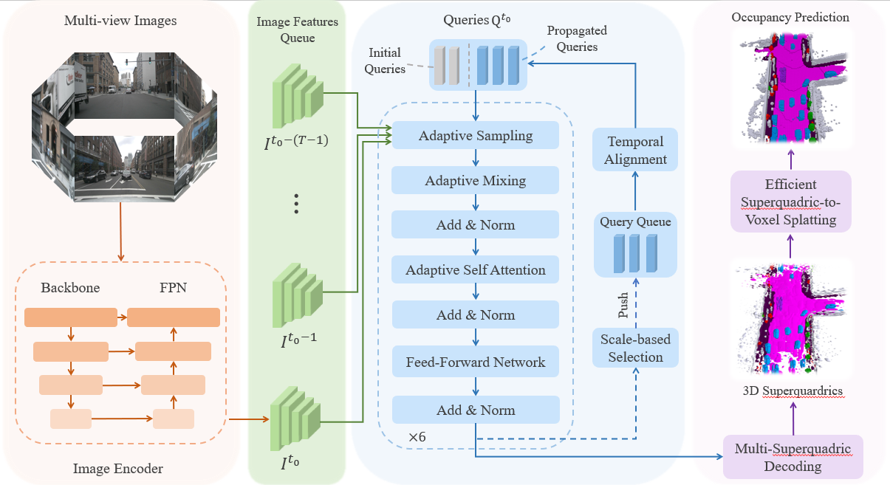
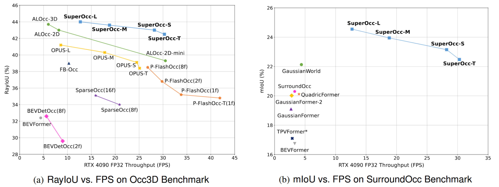
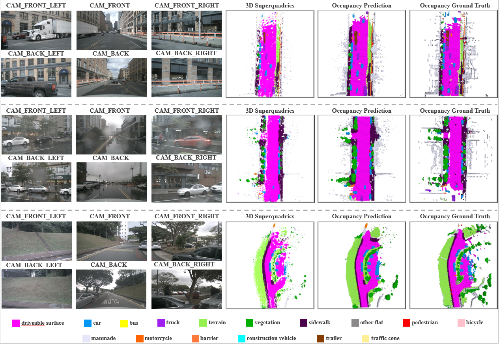

<div align="center">

# SuperOcc: Toward Cohesive Temporal Modeling for Superquadric-based Occupancy Prediction
</div>


## News
- **[2026/01/27]** We release the code and pretrained weights.
- **[2026/01/21]** SuperOcc is on [Arxiv](https://arxiv.org/abs/2601.15644).

## Getting Started
- [Installation](docs/install.md)
- [Data Preparation](docs/prepare_dataset.md)
- [Train and Eval](docs/train_and_eval.md)

## Method
3D occupancy prediction plays a pivotal role in the realm of autonomous driving, as it provides a 
comprehensive understanding of the driving environment.  Most existing methods construct dense scene 
representations for occupancy prediction, overlooking the inherent sparsity of real-world driving 
scenes. Recently, 3D superquadric representation has emerged as a promising sparse alternative to 
dense scene representations due to the strong geometric expressiveness of superquadrics. However, 
existing superquadric frameworks still suffer from insufficient temporal modeling, a challenging 
trade-off between query sparsity and geometric expressiveness, and inefficient superquadric-to-voxel 
splatting. 
To address these issues, we propose SuperOcc, a novel framework for superquadric-based 3D occupancy 
prediction. SuperOcc incorporates three key designs: (1) a cohesive temporal modeling mechanism to 
simultaneously exploit view-centric and object-centric temporal cues; (2) a multi-superquadric 
decoding strategy to enhance geometric expressiveness without sacrificing query sparsity; and (3) an 
efficient superquadric-to-voxel splatting scheme to improve computational efficiency. Extensive 
experiments on the SurroundOcc and Occ3D benchmarks demonstrate that SuperOcc achieves 
state-of-the-art performance while maintaining superior efficiency.



## Benchmark Results


### results on Occ3D:
|                                  Models                                   | Epochs | *Q*  | mIoU | RayIoU | FPS  |                      Link                       |
|:-------------------------------------------------------------------------:|:------:|:----:|:----:|:------:|:----:|:-----------------------------------------------:|
| [SuperOcc-T](projects/configs/superocc/superocc-t_r50_704_seq_nui_48e.py) |   48   | 600  | 36.1 |  42.5  | 30.3 | [Model](https://huggingface.co/yzzzzc/SuperOcc) |
| [SuperOcc-S](projects/configs/superocc/superocc-s_r50_704_seq_nui_48e.py) |   48   | 1200 | 36.9 |  43.0  | 28.2 | [Model](https://huggingface.co/yzzzzc/SuperOcc) |
| [SuperOcc-M](projects/configs/superocc/superocc-m_r50_704_seq_nui_48e.py) |   48   | 2400 | 37.4 |  43.6  | 18.8 | [Model](https://huggingface.co/yzzzzc/SuperOcc) |
| [SuperOcc-L](projects/configs/superocc/superocc-l_r50_704_seq_nui_48e.py) |   48   | 3600 | 38.1 |  44.0  | 12.7 | [Model](https://huggingface.co/yzzzzc/SuperOcc) |

### results on SurroundOcc:
|                                        Models                                         | Epochs | *Q*  |  IoU  | mIoU  | FPS  |                      Link                       |
|:-------------------------------------------------------------------------------------:|:------:|:----:|:-----:|:-----:|:----:|:-----------------------------------------------:|
| [SuperOcc-T](projects/configs/superocc_surroundocc/superocc-t_r50_704_seq_nui_24e.py) |   24   | 600  | 34.91 | 22.48 | 30.3 | [Model](https://huggingface.co/yzzzzc/SuperOcc) |
| [SuperOcc-S](projects/configs/superocc_surroundocc/superocc-s_r50_704_seq_nui_24e.py) |   24   | 1200 | 35.63 | 23.12 | 28.2 | [Model](https://huggingface.co/yzzzzc/SuperOcc) |
| [SuperOcc-M](projects/configs/superocc_surroundocc/superocc-m_r50_704_seq_nui_24e.py) |   24   | 2400 | 36.99 | 23.95 | 18.8 | [Model](https://huggingface.co/yzzzzc/SuperOcc) |
| [SuperOcc-L](projects/configs/superocc_surroundocc/superocc-l_r50_704_seq_nui_24e.py) |   24   | 3600 | 38.13 | 24.55 | 12.7 | [Model](https://huggingface.co/yzzzzc/SuperOcc) |

## Visualization


## Acknowledgement

Many thanks to these excellent open-source projects:

* 3D Occupancy: [QuadricFormer](https://github.com/zuosc19/QuadricFormer) [OPUS](https://github.com/jbwang1997/OPUS) [SparseOcc](https://github.com/MCG-NJU/SparseOcc) 
* 3D Detection: [StreamPETR](https://github.com/exiawsh/StreamPETR)
* Codebase: [MMDetection3D](https://github.com/open-mmlab/mmdetection3d)

## Bibtex
If this work is helpful for your research, please consider citing the following BibTeX entry.
```
@article{yu2026superocc,
  title={SuperOcc: Toward Cohesive Temporal Modeling for Superquadric-based Occupancy Prediction},
  author={Yu, Zichen and Liu, Quanli and Wang, Wei and Zhang, Liyong and Zhao, Xiaoguang},
  journal={arXiv preprint arXiv:2601.15644},
  year={2026}
}